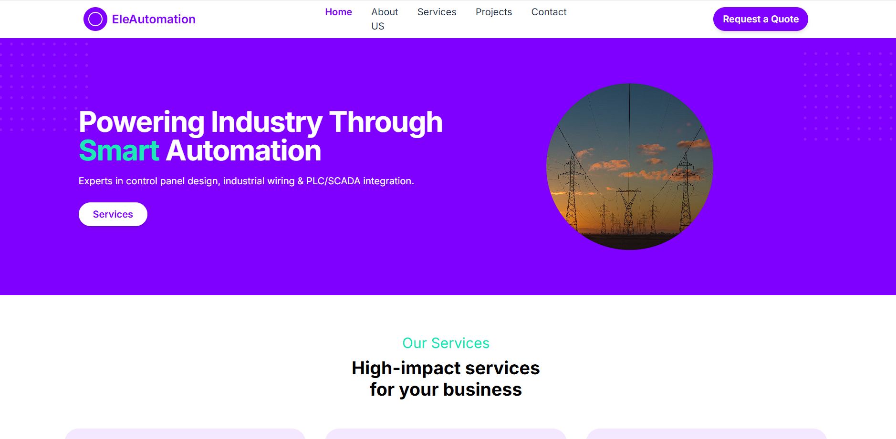
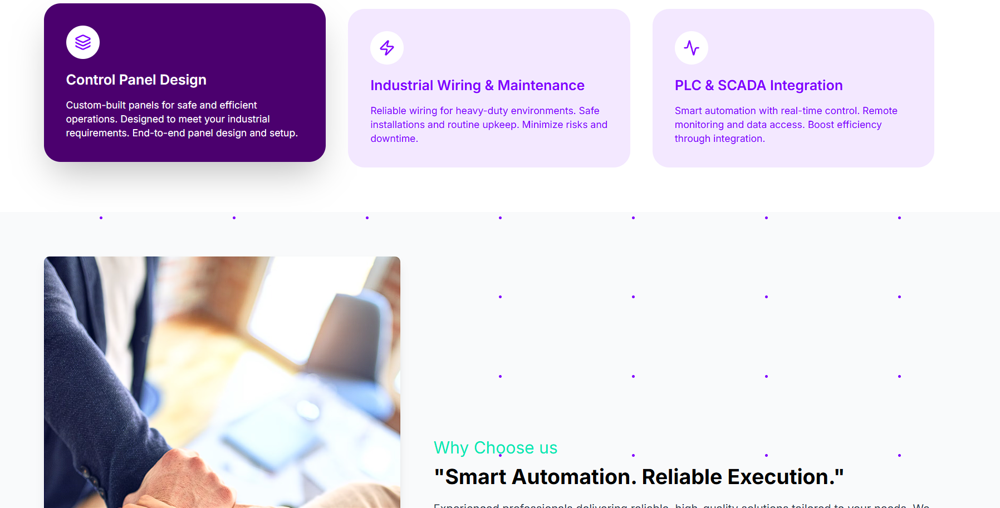
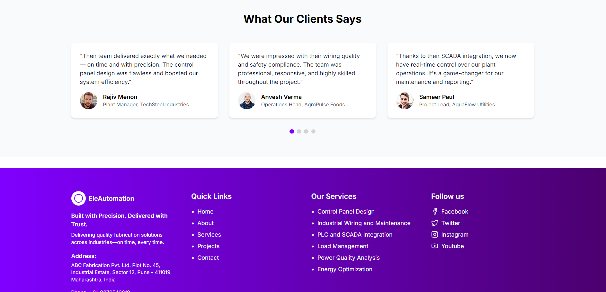
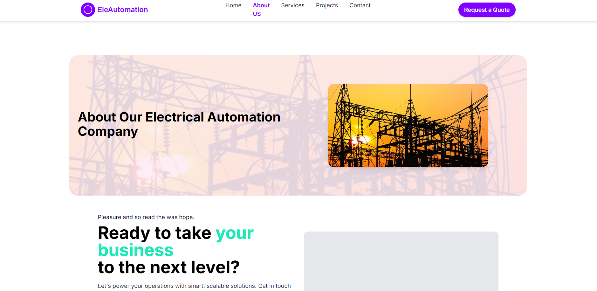
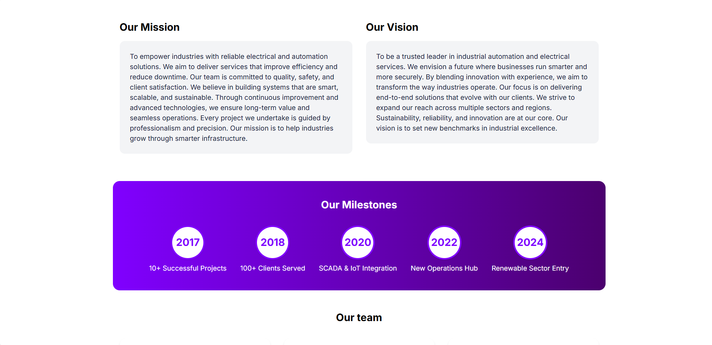
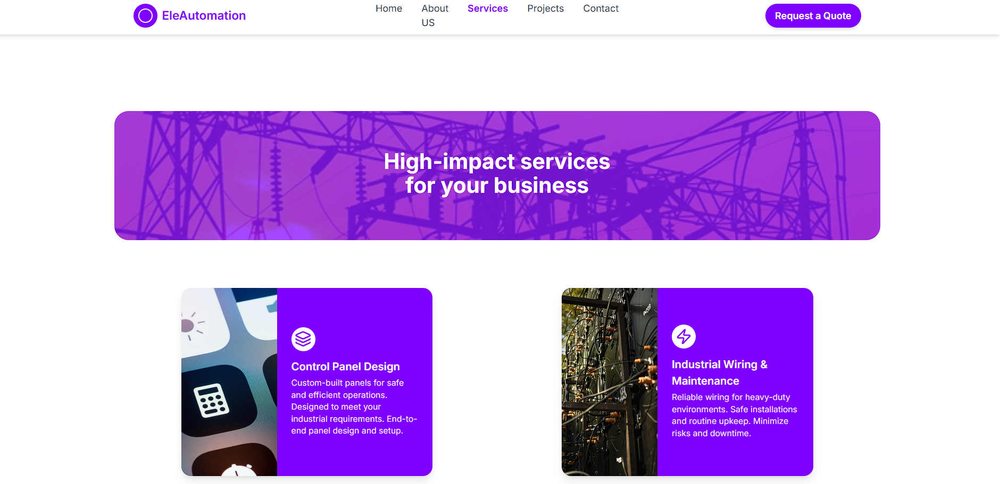
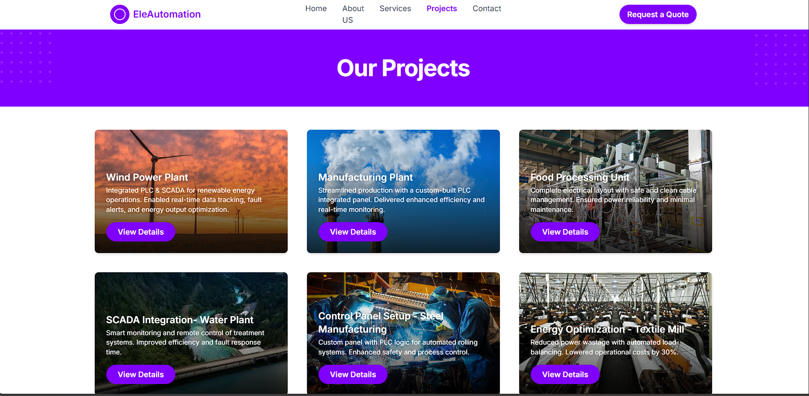
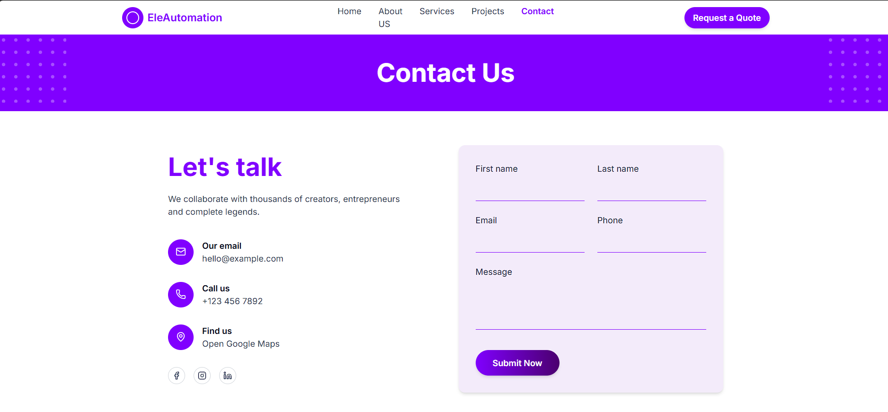
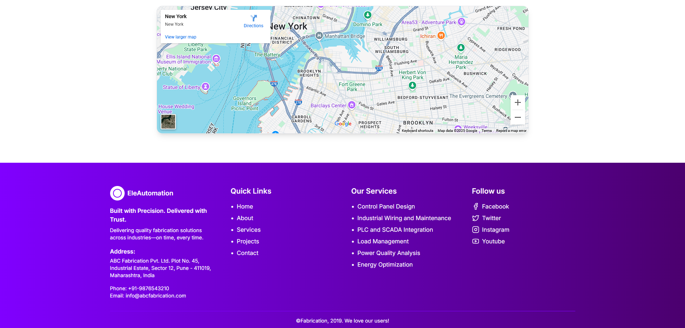

# React + Vite Starter

This project is a minimal React setup using [Vite](https://vitejs.dev/) for fast development and hot module replacement (HMR). ESLint is configured for code quality.

## Features

- ⚡ Vite for blazing-fast dev server and build
- ⚛️ React with functional components and hooks
- 🧹 ESLint with basic rules
- ♻️ Hot Module Replacement (HMR)

## Getting Started

### Prerequisites

- [Node.js](https://nodejs.org/) (version 16+ recommended)
- npm (comes with Node.js)

### Installation

To install dependencies and start the development server:

npm install
npm run dev 

## Preview 

## Preview

  
  
  
  
  
  
  
  
  
  

